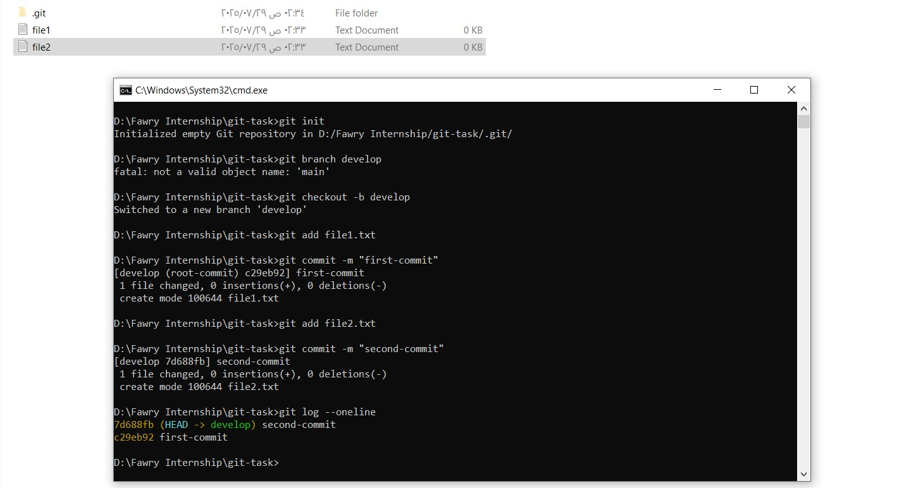
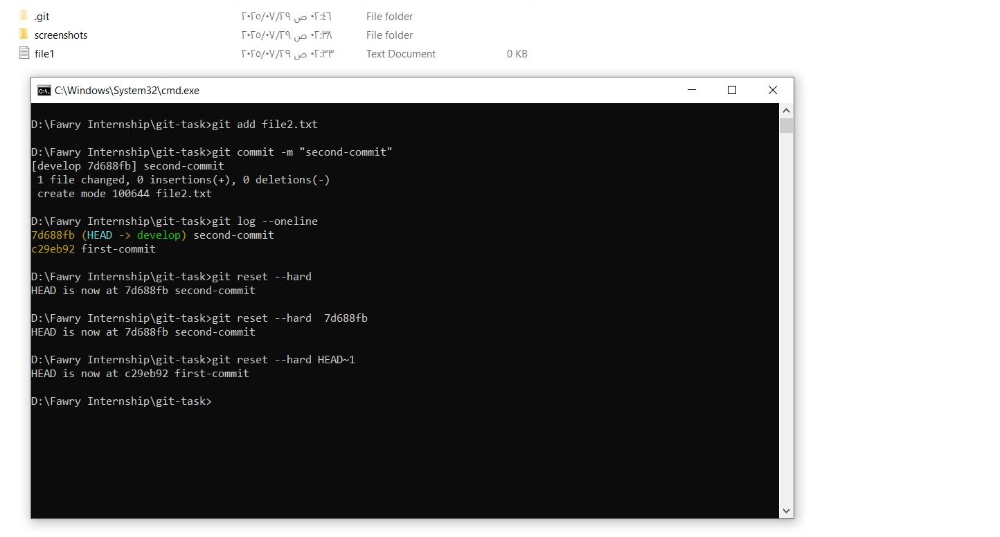
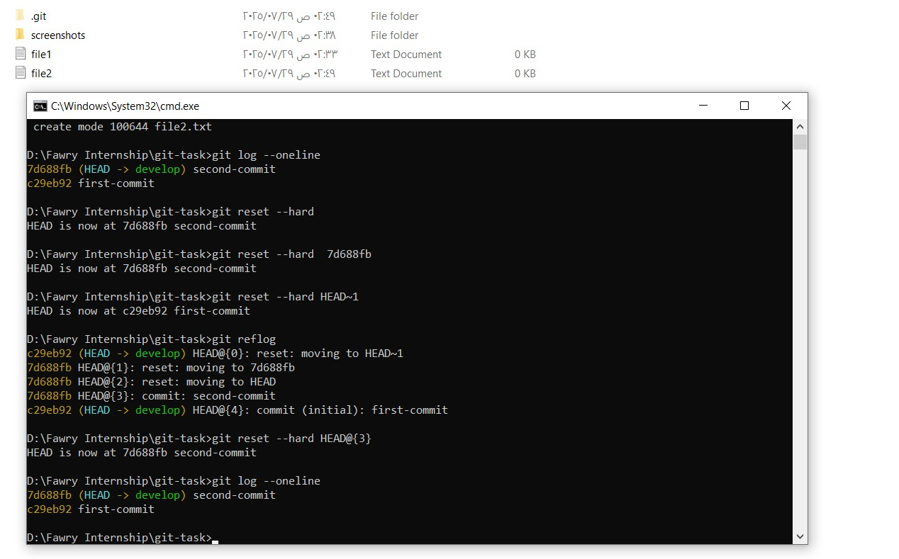
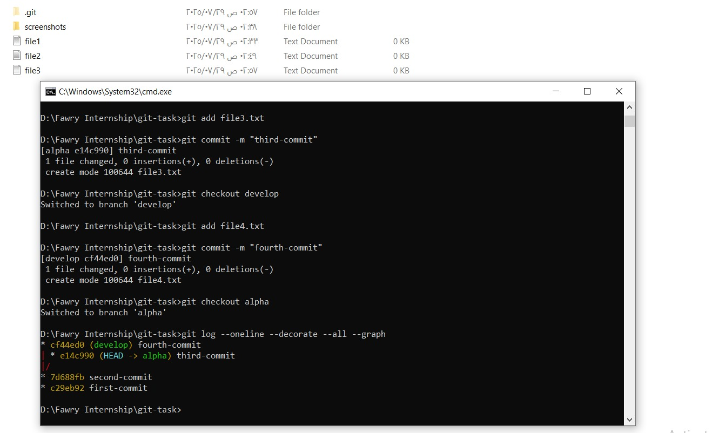
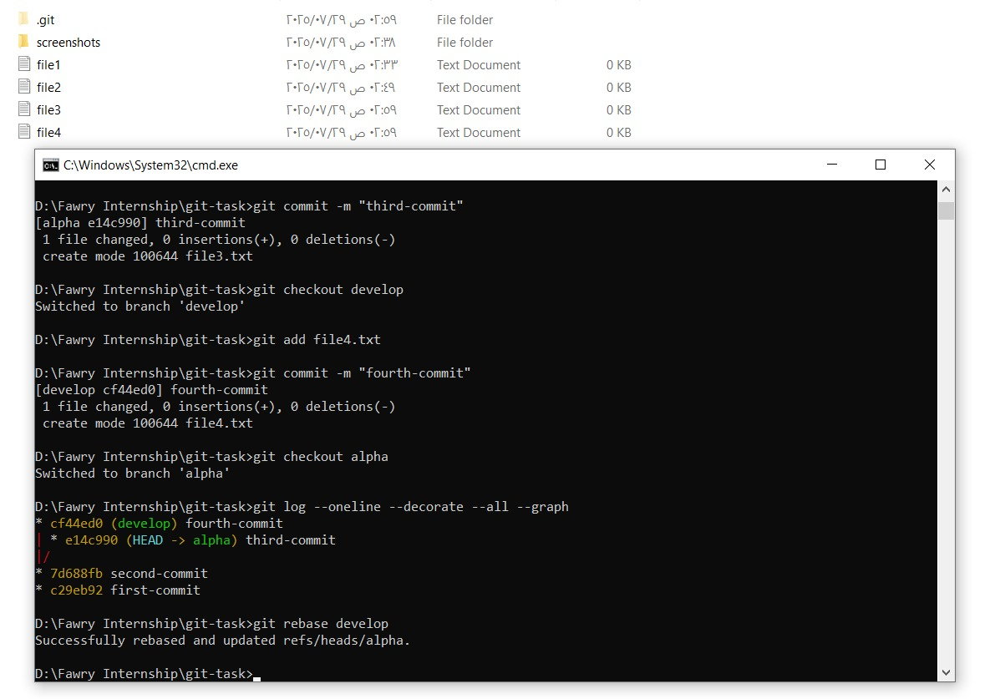

# Git Task – Fawry Internship

This project demonstrates using Git for branch management, commit history tracking, `reflog` navigation, and rebasing.

---

## 📸 Screenshots

### 1. Git log showing commit history


### 2. After resetting from second-commit to first-commit


### 3. Recovered second-commit using reflog


### 4. Git graph showing all branches and commits


### 5. After rebasing develop onto alpha


---

## 🧠 Commands Used

```bash
git branch develop
git branch alpha
git checkout develop
git add file1.txt
git commit -m "first-commit"
git add file2.txt
git commit -m "second-commit"
git reset --hard HEAD~1
git reflog
git reset --hard HEAD@{n}
git checkout alpha
git add file3.txt
git commit -m "third-commit"
git checkout develop
git add file4.txt
git commit -m "fourth-commit"
git log --oneline --decorate --all --graph
git rebase develop
